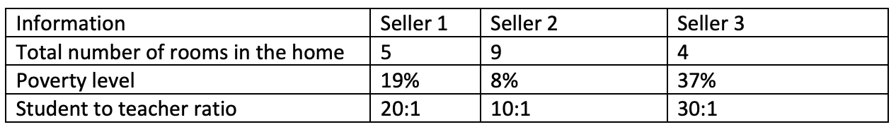

# Enterprise Intelligence Development Project

I have adressed two business problems,

1. Regression Problem
2. Classification Problem

The professional deliverable includes the following sections,
1. Definition of the business problem
2. Objectives
3. Approach
4. Data Import
5. Data Analysis
6. Data Visualization
7. Findings valuable insights from data visualization
8. Predictive modeling
9. Challenges/Limitations
10. Recommendations
11. Future Scope

## Regression Problem - Boston Housing Prices

### Objectives
A real estate agent was asked to help the Sellers in selling their houses in Boston at reasonable prices based on given details of the houses such as,

- Number of rooms in the house
- Poverty level in the neighboring area
- Teacher to Student Ratio in the neighboring area

Seller's housing information:

Based on above details project forecasts incorporates immense, valuable research,

- Data analysis and visualization on past Boston Housing data to find valuable insights from raw data and given data by Sellers
- Building predictive algorithms to best recommend the house prices
- Justification of recommended housing prices
- Other necessary factors to consider for selling the house

### Approach
Data analysis and visualization on past Boston Housing data to find valuable insights from raw data and given data by Sellers
- Statistical Descriptive Analysis
- Exploring trends and patterns in the data
- Relationships between various attributes of houses in the data

Building predictive algorithms to best recommend the house prices
- Based on findings and results on past Boston Housing data, we would try to predict best reasonable housing prices to the sellers

Justification of recommended housing prices
- Based on predicted housing prices for the given data, we would strongly justify on recommended prices

Other necessary factors to consider for selling the house
- Find out other meaningful and valuable attributes/factors that need to be evaluated for more better recommendations on the house prices

### Machine Learning Algorithms

Linear Regression

### Optimization Technique

**Ordinary Least Square Algorithm**

Based on predicitive modeling, a real estate agent can provide the reasonable house prices which would be very useful for the sellers to sell their houses at good value in Boston area.

**Boston Housing Dataset:**

## Classification Problem - PIMA Indians Diabetes Data

### Introduction
PIMA Indians are a group Native American people who lives in the Phoenix, Arizona. So many years, these people are are living with poor diet which where carbohydrate deficiency seems more and in turn, they are exposed to type 2 diabetes among children as well as adults.

To deal with such a huge and deadly disease, many Medicare organizations are trying to achieve their best possible solutions to diagnose the diabetes among children as well as adults to mitigate the risk of diabetes in the future, to reduce the period required for diagnosis with exact identification of people having diabetes as fast as possible, and to provide proper treatment for diabetic people for a reduction in the severity of complications associated with this disease.

### Objectives
Client wants to make the best decision on a business problem of classifying the right number of people who have diabetes and who do not have diabetes to invest valuable time towards the proper treatment of diabetic patients rather than in diabetes testing.

Based on the business problem, project forecasts incorporates valuable research,

- Data analysis and visualization on the PIMA Indians diabetes data to find valuable insights to provide more exposure to various important factors and their contribution
- Building predictive algorithms to identify a person has diabetes or not
- Justification and necessary medical attributes contributing to identifying a person as a diabetic
- Recommendation for client

### Approach
Data analysis and visualization on the PIMA Indians diabetes data to find valuable insights to provide more exposure to various important factors and their contribution
- Statistical Descriptive Analysis
- Exploring trends and patterns in the data
- Correlations between various medical attributes of a person in the data

Building predictive algorithms to identify a person has diabetes or not
- Based on findings and results the PIMA Indians diabetes data, we would best classify the people having diabetes from non-diabetic people

Justification and necessary medical attributes contributing to identifying a person as a diabetic
- Based on classification observed by algorithm for the data, we would strongly justify our classified diabetic people from non-diabetic people with vital medical attributes

Recommendation for Client
- Based on classification results between diabetic or non-diabetic people, we would recommend client with the best possible actions on a business problem and how to deal with it in intermediate years in medicare industry.

### Machine Learning Algorithms
1. Logistic Regression
2. K-Nearest Neighbor (KNN)
3. Random Forest

Based on predicitive modeling, a client should be able to make a confident decision based on the performance of final model for identifying diabetic people from non-diabetic people. 

**PIMA Indians Diabetes Dataset:**

